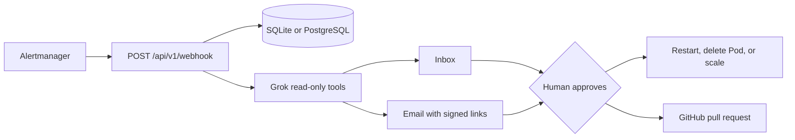

# Alert processor

Alert processor receives [Alertmanager](https://prometheus.io/docs/alerting/latest/alertmanager/) webhooks, asks [xAI Grok](https://docs.x.ai/) to investigate the cluster with read-only Kubernetes calls, and waits for a person to approve the result.

Approval can do only four things:

- restart a Deployment
- delete one named Pod
- scale a Deployment, capped by `MAX_SCALE_REPLICAS` (default 10)
- open a pull request with a proposed YAML file

Nothing is merged or applied from Git automatically. There is no shell, no `kubectl exec`, and no action outside that list. `acknowledge` records the alert and changes nothing.



## Requirements

- Python 3.12 or newer
- An xAI API key if you want recommendations (`XAI_API_KEY`)
- A kubeconfig, or a pod ServiceAccount, if investigation or approved actions should touch a cluster
- Optional: SMTP, a GitHub fine-grained token, PostgreSQL

## Run locally

```bash
python3 -m venv .venv
source .venv/bin/activate
pip install -r requirements.txt
cp .env.example .env
# edit .env, then:
set -a && source .env && set +a
make run
```

Open http://127.0.0.1:8080 and log in with `AUTH_PASSWORD`.

The development signing secret is refused as a production setting in the logs. Set `SIGNING_SECRET` to a long random value before anyone else can reach the process:

```bash
python3 -c 'import secrets; print(secrets.token_urlsafe(32))'
```

Simulate Alertmanager:

```bash
curl -sS http://127.0.0.1:8080/api/v1/webhook \
  -H 'Content-Type: application/json' \
  -d '{"status":"firing","groupKey":"{}:{alertname=KubePodCrashLooping}","commonLabels":{"alertname":"KubePodCrashLooping","namespace":"demo","severity":"warning"},"alerts":[{"status":"firing","labels":{"alertname":"KubePodCrashLooping","namespace":"demo","severity":"warning","pod":"web-0"},"annotations":{"summary":"Pod crash looping"},"fingerprint":"abc"}]}'
```

`Watchdog` and `InfoInhibitor` are ignored. Change that with `SKIP_ALERTNAMES`.

Without `XAI_API_KEY` the alert is stored and the recommendation is `acknowledge`. Without kubeconfig, investigation tools return an error to the model and the inbox still works.

## Configure

Copy [`.env.example`](.env.example). Values below are the ones you will actually change.

| Variable | Required | Purpose |
|---|---|---|
| `XAI_API_KEY` | for recommendations | xAI API key |
| `XAI_MODEL` | no | default `grok-4-1-fast-non-reasoning` |
| `AUTH_PASSWORD` | for local login | Shared inbox password. Not used when a proxy sets `X-Forwarded-User` |
| `SIGNING_SECRET` | yes, outside local dev | HMAC secret for email links and session cookies. Falls back to `AUTH_PASSWORD`, then a development default |
| `PUBLIC_BASE_URL` | yes | Origin used in email links, no path. `https` turns on the Secure cookie flag |
| `CLUSTER_NAME` | no | Shown in the inbox header and included in the model prompt |
| `WEBHOOK_TOKEN` | strongly recommended | If set, Alertmanager must send `Authorization: Bearer <token>` |
| `GITHUB_TOKEN` | for pull requests | Fine-grained token with contents and pull requests on `GITHUB_REPO` |
| `GITHUB_REPO` | for pull requests | `owner/name`. Empty disables pull requests |
| `GITOPS_PATH_PREFIXES` | no | Comma-separated directories a proposal may touch |
| `GITOPS_PROPOSAL_PREFIX` | no | Fallback path when the model suggests a path outside those prefixes |
| `SMTP_HOST` / `SMTP_PORT` | for email | Default `smtp.gmail.com:587` (STARTTLS) |
| `SMTP_USER` / `SMTP_PASSWORD` / `MAIL_TO` | for email | All three are required or mail is skipped |
| `MAIL_FROM` | no | Defaults to `SMTP_USER` |
| `DATABASE_URL` | no | PostgreSQL URL. Empty uses SQLite under `DATA_DIR` |
| `DATA_DIR` | no | SQLite directory. Default `/data`, or `./data` for local runs |
| `OAUTH_LOGOUT_URL` | behind oauth-proxy | Where the Log out button sends an OpenShift user |
| `OAUTH_COOKIE_NAME` | behind oauth-proxy | Cookie the Log out button clears. Default `_oauth_proxy_ap` |
| `MAX_SCALE_REPLICAS` | no | Upper bound for scale actions. Default `10`. Scale to 0 is rejected |
| `SKIP_ALERTNAMES` | no | Default `Watchdog,InfoInhibitor` |

More than one replica requires `DATABASE_URL`. SQLite on an `emptyDir` is only safe at one replica.

## What approval is allowed to do

Writes are limited to a DNS-1123 name in the alert's namespace. `kube-system`, `kube-public`, and `kube-node-lease` are always denied. Any `kube-*` or `openshift-*` namespace is writable only when it is the namespace on the alert itself, so a demo alert cannot restart a platform namespace.

Git proposals must end in `.yaml`, `.yml`, or `.md`, must not contain `..`, and must sit under `GITOPS_PATH_PREFIXES`. The default prefixes match a common OpenShift GitOps layout (`apps-kustomize/`, `cluster-kustomize/`, `operator-subscriptions/`, `apps-argo/`, `gitops-oai/`). Point those at your own tree.

Email links (`/t/...`) render a confirm button. A GET does not approve, so mail prefetch cannot execute an action. Tokens expire after `TOKEN_TTL_SECONDS` (default 24 hours).

## Deploy

Example manifests are in [`deploy/kubernetes/`](deploy/kubernetes/). They are a single-replica Deployment, a ClusterIP Service, and the RBAC the process needs. Create the Secret yourself. Do not commit it.

```bash
kubectl create namespace alert-processor
kubectl -n alert-processor create secret generic alert-processor \
  --from-literal=XAI_API_KEY \
  --from-literal=AUTH_PASSWORD \
  --from-literal=SIGNING_SECRET \
  --from-literal=WEBHOOK_TOKEN \
  --from-literal=GITHUB_TOKEN \
  --from-literal=SMTP_PASSWORD
kubectl apply -k deploy/kubernetes
```

Build the image from [`Containerfile`](Containerfile) (identical runtime flags to [`Dockerfile`](Dockerfile)):

```bash
podman build -t alert-processor:local -f Containerfile .
```

Point Alertmanager at the in-cluster Service, not at the inbox URL. A sample webhook receiver is in [`deploy/alertmanager-webhook.example.yaml`](deploy/alertmanager-webhook.example.yaml).

On OpenShift, put the inbox Route behind oauth-proxy and leave the webhook on the Service. See [`deploy/openshift/README.md`](deploy/openshift/README.md).

Interactive API docs are served at `/docs` while the process is running.

## Development

```bash
make test
```

Tests use a temporary SQLite file and do not call xAI, SMTP, GitHub, or a cluster. CI runs the same suite on Python 3.12 and 3.13.

See [CONTRIBUTING.md](CONTRIBUTING.md) for pull requests and [SECURITY.md](SECURITY.md) before you expose a deployment.

## License

[Apache-2.0](LICENSE). Copyright 2026 David Turner.
